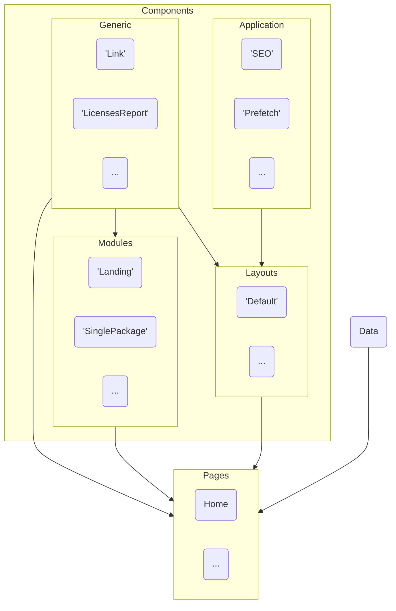

# 🚀  Julian's Web Garden

[](https://astro.build)
[](https://sass-lang.com)
[](http://www.typescriptlang.org/)  
[](./LICENSE)
[](https://www.conventionalcommits.org)
[](https://makeapullrequest.com)  
[](https://prettier.io)
[](https://editorconfig.org)
[](https://eslint.org)
[](https://stylelint.io)

<!-- [](https://app.renovatebot.com/dashboard) -->

---

Here lies some re-usable components and tooling settings,
taking advantage of Astro strengths as much as possible.

Focus is on common web patterns and progressive enhancements.

<!-- > **Note**
> Astro is still in Beta, so is this collection.
> Components API might change a bit, though not drastically.
> Thanks for you understanding ✌️. -->

## 🤷🏼‍♂️  Philosophy

We've all been to the point of throwing valuable code when adopting new
shiny website frameworks.  
Thanks to "island architecture" practices, we can establish standard and
future-proof, commonly used, generic patterns, using the web holy trinity of languages : **HTML** / **CSS** and **JavaScript**.  
That way, we can sprinkle advanced JS widgets as we like, with trendy UI framework, while
things like global application utilities remain stable over time.

Vanilla means future-proofing our code, but it also bring the benefit of
minuscule file sizes compared to "all-or-nothing" UI frameworks.

---

<div class="git-only">

- [🚀  Julian's Web Garden](#julians-web-garden)
  - [🤷🏼‍♂️  Philosophy](#️philosophy)
- [🔗  Quick links](#quick-links)
  - [LIVE DEMO  🎭  DOCUMENTATION WEBSITE ⎋](#live-demo--documentation-website)
    - [Architecture](#architecture)
      - [Terminology](#terminology)
  - [📖  Website source code](#website-source-code)
  - [📦  Application-level components](#application-level-components)
  - [📦  Components](#components)
  - [🛠  Tooling configurations](#tooling-configurations)
- [🚧  To dos](#to-dos)
- [🧑‍🚀  Development](#development)
  - [🏁  Commands](#commands)

---

</div>

# 🔗  Quick links

## [LIVE DEMO  🎭  DOCUMENTATION WEBSITE ⎋](https://code.juliancataldo.com/)

<div class="git-only">

[](https://code.juliancataldo.com)

</div>

[**Production** deployed on **`code.juliancataldo.com`**](https://code.juliancataldo.com/).  
_[**Mirror** deployed on **`web-garden.netlify.app`**](https://web-garden.netlify.app)._
[See **Production** GitHub workflow](https://github.com/JulianCataldo/web-garden/blob/develop/.github/workflows/production.yml)

[**Develop** deployed on **`develop--web-garden.netlify.app`**](https://develop--web-garden.netlify.app).  
[See **Branch** GitHub workflow](https://github.com/JulianCataldo/web-garden/blob/develop/.github/workflows/branch.yml)

Deployed on Netlify via GitHub actions.

<!-- TODO: integrate mermaid renderer into website / or pre-render SVG -->

### Architecture



---

#### Terminology

- **Pages**: the base component entry point.  
  All other parts (**layouts**, generic **components**, **modules**…) and data are directly or indirectly gathered from here.
- **Layout**: Where your website shells lives. This is where you put your global navigation, footer…
  Alternative layouts can be created like  
  `Print`, `Compact`, `Bare`, `Blog`…
- **App-level component**: used everywhere, anytime, for a given **layout**, which import them.  
  E.g. Color modes handler, breakpoints handler…
- **Component**: Ubiquitous general purpose, atomic components.  
  E.g. icons, images, links, maps, videos…
- **Module**: Complex set of components, forming a single purpose page view/section.  
  E.g. `Landing`, `SinglePackage`, `ContactForm`…
- **Data**: Local JSONs, Markdown files, remote APIs…  
  Should be fetched from **pages**. Note that this is not a hard rule or a technical limitation with Astro as with other frameworks.  
  Ultimately, this pattern makes data-flow easier to follow ("top -> down"), preventing spaghetti code, duplications and performance hogs.

## [📖  Website source code](https://github.com/JulianCataldo/web-garden/tree/master/demo)

See [default layout](demo/src/layouts/Default/Default.astro) and [home page](https://github.com/JulianCataldo/web-garden/blob/develop/demo/src/pages/index.astro)
for live implementation examples.

---

## [📦  Application-level components](https://github.com/JulianCataldo/web-garden/tree/develop/app)

[These are global components](https://github.com/JulianCataldo/web-garden/tree/develop/app) which enhance or augment browser behavior and style,
while providing useful utilities to developers, website-wide.

<!-- AUTO-GENERATED-CONTENT:START (DIRTREE:dir=./app) -->
```
app/
├── BaseDocument/
├── Breakpoints/
├── ColorMode/
├── GoogleAnalytics/
├── HoverPrefetch/
├── Lightbox/
├── Navigation/
├── PageTransition/
├── Resets/
├── ScrollObserver/
├── SEOMetadata/
└── Tooltips/
```
<!-- AUTO-GENERATED-CONTENT:END -->

## [📦  Components](https://github.com/JulianCataldo/web-garden/tree/develop/components)

Generic [extendables components](https://github.com/JulianCataldo/web-garden/tree/develop/components).

<!-- AUTO-GENERATED-CONTENT:START (DIRTREE:dir=./components) -->
```
components/
├── Diagram/
├── GeoMap/
├── LicensesReport/
├── Link/
├── Tabs/
├── TerminalPlayer/
└── Testbed/
```
<!-- AUTO-GENERATED-CONTENT:END -->

## [🛠  Tooling configurations](https://github.com/JulianCataldo/web-garden/tree/develop/configs)

[A useful collection](https://github.com/JulianCataldo/web-garden/tree/develop/configs) for web developers.  
Features ESLint, Prettier, Stylelint, Commitlint…  
For Astro, React, Vue, SCSS, TS…

<!-- AUTO-GENERATED-CONTENT:START (DIRTREE:dir=./configs) -->
```
configs/
├── .vscode/
├── .editorconfig-example
├── commitlint-base.ts
├── eslint-all.cjs
├── eslint-astro.cjs
├── eslint-js.cjs
├── eslint-jsx.cjs
├── eslint-ts.cjs
├── eslint-tsx.cjs
├── eslint-vue.cjs
├── gather.sh
├── index.mjs
├── prettier-astro.cjs
├── prettier-base.cjs
└── stylelint-all.cjs
```
<!-- AUTO-GENERATED-CONTENT:END -->

<!-- # ✅  Tests

Cypress:

- [ ] App/Analytics
- [x] App/Base
- [ ] App/Prefetch
  - Broken: `realHover` [issue](https://github.com/dmtrKovalenko/cypress-real-events/issues/247)
- [ ] App/Resets
- [ ] App/Breakpoints
- [ ] App/ColorMode
- [x] App/Scroll/Observer
- [ ] App/SEO
- [x] App/Tooltips
- [x] App/Transition
  - [ ] External / contact links
- [ ] App/Lightbox
- [x] Components/Media/Map
- [ ] Components/Link
  - [ ] External / contact links
- [ ] Components/LicensesReport
- [ ] … -->

# 🚧  To dos

- [ ] Find a way to launch only necessary tests when versioning
- [ ] Implement dev / prod mode for debugging outputs
- [ ] Evaluate PNPM workspaces + tools for replacing Lerna version/publish?
- [ ] Fix Lerna conventional commits not following breaking changes for versioning
- [ ] Full no JS compatibility / fallbacks checks
  - [ ] Fix CSS theme not loading
- [ ] Fix flash of unstyled text (critical font loading strategy)

<!-- # 🧫  Experimenting -->

<!-- - Website full theme switcher, in addition to color dark / light variants. -->
<!-- - Feature flag manager -->
<!-- - Copy to clipboard -->
<!-- - Algolia search -->
<!-- - SSR Mermaid -->
  <!-- - Easy fonts integration -->
  <!-- - Easy iconify integration -->

# 🧑‍🚀  Development

## 🏁  Commands

```zsh
# Clone mono-repository
git clone https://github.com/JulianCataldo/web-garden

# Scripts located in root ./package.json

# Bootstrap all packages dependencies
pnpm install --recursive

# Launch implementations demo website
pnpm run demo

# Cypress: Open dev GUI
pnpm run cypress:open

# Cypress: Run test suite
pnpm run cypress:run

# Linkinator: Run links checker with report
pnpm run test:links

# Pre-release, does:
# 1. Packages bump based on commits
# 2. Tagging releases
# 3. Git push
pnpm run version

# Release updated packages on NPM public registry
pnpm run release
```

<div class="git-footer">

---

Other projects:

- [astro-content](https://github.com/JulianCataldo/astro-content): A text based, structured content manager, for edition and consumption.
- [remark-lint-frontmatter-schema](https://github.com/JulianCataldo/remark-lint-frontmatter-schema): Validate your Markdown **frontmatter** data against a **JSON schema**.
- [retext-case-police](https://github.com/JulianCataldo/retext-case-police): Check popular names casing. Example: ⚠️ `github` → ✅ `GitHub`.
- [remark-embed](https://github.com/JulianCataldo/remark-embed): A `remark` plugin for embedding remote / local Markdown or code snippets.

---

🔗  [JulianCataldo.com](https://www.juliancataldo.com/)

</div>
