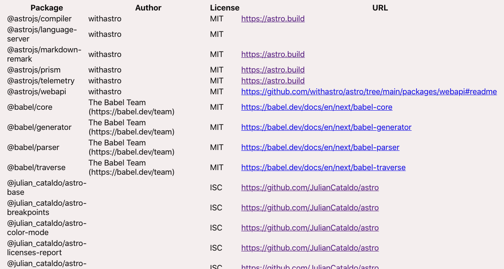

# Astro components and configurations collection

Here lies some re-usable components and tooling settings,
taking advantage of Astro strengths as much as possible.

Focus is on common web patterns and progressive enhancements.

See [./demo/src/layouts/Layout.astro](./demo/src/layouts/Layout.astro) and [./demo/src/pages/index.astro](./demo/src/pages/index.astro)
for full implementation demo.

> **Note**  
> Astro is still in Beta, so is this collection.  
> Components API might change a bit, though not drastically.  
> Thanks for you understanding ✌️.

---

- [Astro components and configurations collection](#astro-components-and-configurations-collection)
- [📦  Application-level components](#application-level-components)
  - [Base document enclosure — \[astro-base\]](#base-document-enclosure--astro-base)
  - [CSS Resets — \[astro-resets\]](#css-resets--astro-resets)
  - [Color mode, with user override — \[astro-color-mode\]](#color-mode-with-user-override--astro-color-mode)
  - [Full page transition — \[astro-transition\]](#full-page-transition--astro-transition)
  - [Scroll observer — \[astro-scroll-observer\]](#scroll-observer--astro-scroll-observer)
  - [Breakpoints handlers with (S)CSS / DOM / JS — \[astro-breakpoints\]](#breakpoints-handlers-with-scss--dom--js--astro-breakpoints)
  - [URLs prefetching — \[astro-prefetch\]](#urls-prefetching--astro-prefetch)
  - [Tooltips — \[astro-tooltips\]](#tooltips--astro-tooltips)
  - [Lightbox — \[astro-lightbox\]](#lightbox--astro-lightbox)
  - [SEO — \[astro-seo\]](#seo--astro-seo)
  - [Traffic analysis — \[astro-analytics\]](#traffic-analysis--astro-analytics)
- [📦  Components](#components)
  - [Link, with smart optimizations — \[astro-link\]](#link-with-smart-optimizations--astro-link)
  - [Media map embed — \[astro-media-map\]](#media-map-embed--astro-media-map)
  - [Packages licenses report generator — \[astro-licenses-report\]](#packages-licenses-report-generator--astro-licenses-report)
- [👀  Astro demo website](#astro-demo-website)
- [⚙️  Tooling configurations — \[astro-configs\]](#️tooling-configurations--astro-configs)
- [🚧  To dos](#to-dos)
- [✅  Tests](#tests)
- [🧑‍🚀  Development](#development)
  - [Commands](#commands)
  - [🦾  Contribute](#contribute)

---

# 📦  Application-level components

## Base document enclosure — \[astro-base\]

**📦  [See component instructions](./app/Base)**

## CSS Resets — \[astro-resets\]

**📦  [See component instructions](./app/Resets)**

## Color mode, with user override — \[astro-color-mode\]

**📦  [See component instructions](./app/ColorMode)**

## Full page transition — \[astro-transition\]

https://user-images.githubusercontent.com/603498/174424456-edce69a7-adef-4e59-b2d8-cfc22414b8a4.mp4

---

**📦  [See component instructions](./app/Transition)**

## Scroll observer — \[astro-scroll-observer\]

https://user-images.githubusercontent.com/603498/174468167-4f3cdbe3-ec90-49f6-8c51-d6028605c7d6.mp4

---

**📦  [See component instructions](./app/Scroll/Observer)**

## Breakpoints handlers with (S)CSS / DOM / JS — \[astro-breakpoints\]

**📦  [See component instructions](./app/Breakpoints)**

## URLs prefetching — \[astro-prefetch\]

https://user-images.githubusercontent.com/603498/174425991-7151f1b1-0192-4508-8e6c-3e0d8eabed0d.mp4

---

**📦  [See component instructions](./app/Prefetch)**

## Tooltips — \[astro-tooltips\]

https://user-images.githubusercontent.com/603498/174427470-cd84028c-4f2f-41d0-8297-e71f21ad62f5.mp4

---

**📦  [See component instructions](./app/Tooltips)**

## Lightbox — \[astro-lightbox\]

**📦  [See component instructions](./app/Lightbox)**

## SEO — \[astro-seo\]

**📦  [See component instructions](./app/SEO)**

## Traffic analysis — \[astro-analytics\]

**📦  [See component instructions](./app/Analytics)**

# 📦  Components

## Link, with smart optimizations — \[astro-link\]

**📦  [See component instructions](./components/Link)**

## Media map embed — \[astro-media-map\]


**📦  [See component instructions](./components/Media/Map)**

## Packages licenses report generator — \[astro-licenses-report\]



**📦  [See component instructions](./components/LicensesReport)**

# 👀  Astro demo website

[Live website demo documentation](./demo) where you can test all components above.

# ⚙️  Tooling configurations — \[astro-configs\]

[📖  See documentation](./configs).

# 🚧  To dos

- [ ] Fix default package import when possible, as client side JS breaks for now  
       `import Tooltips from '@julian_cataldo/astro-tooltips/Tooltips.astro';`  
       to  
       `import Tooltips from '@julian_cataldo/astro-tooltips';`
- [ ] Find a way to launch only necessary tests when versioning
- [ ] Implement dev / prod mode for debugging outputs
- [ ] Tidy up demo website

---

- [ ] Fully working tooling environment

# ✅  Tests

Cypress:

- [ ] App/Analytics
- [x] App/Base
- [x] App/Prefetch
- [ ] App/Resets
- [ ] App/ColorMode
- [x] App/Scroll/Observer
- [ ] App/SEO
- [x] App/Tooltips
- [x] App/Transition
  - [ ] External / contact links
- [ ] App/Lightbox
- [x] Components/Media/Map
- [ ] Components/Link
- [ ] Components/LicensesReport
- [ ] …

# 🧑‍🚀  Development

## Commands

```zsh
# Scripts located in root ./package.json

# Bootstrap all packages dependencies
pnpm install --recursive

# Launch implementations demo website
pnpm run demo

# Cypress: Open dev GUI
pnpm run cypress:open

# Cypress: Run test suite
pnpm run cypress:run

# Pre-release
# 1. Cypress test suite
# 2. Packages bump based on commits
# 3. Tagging releases
# 4. Git push
pnpm run version

# Release updated packages on NPM public registry
pnpm run publish
```

## 🦾  Contribute

Any remark, feature or pull request can be done is this GitHub repository and issues tracker.  
Committing is linted following [conventional commits conventions](http://conventionalcommits.org).  
This allows an easy and automatic versioning, change-logging, and NPM publishing workflow.

---

🔗  [JulianCataldo.com](https://www.juliancataldo.com/)
