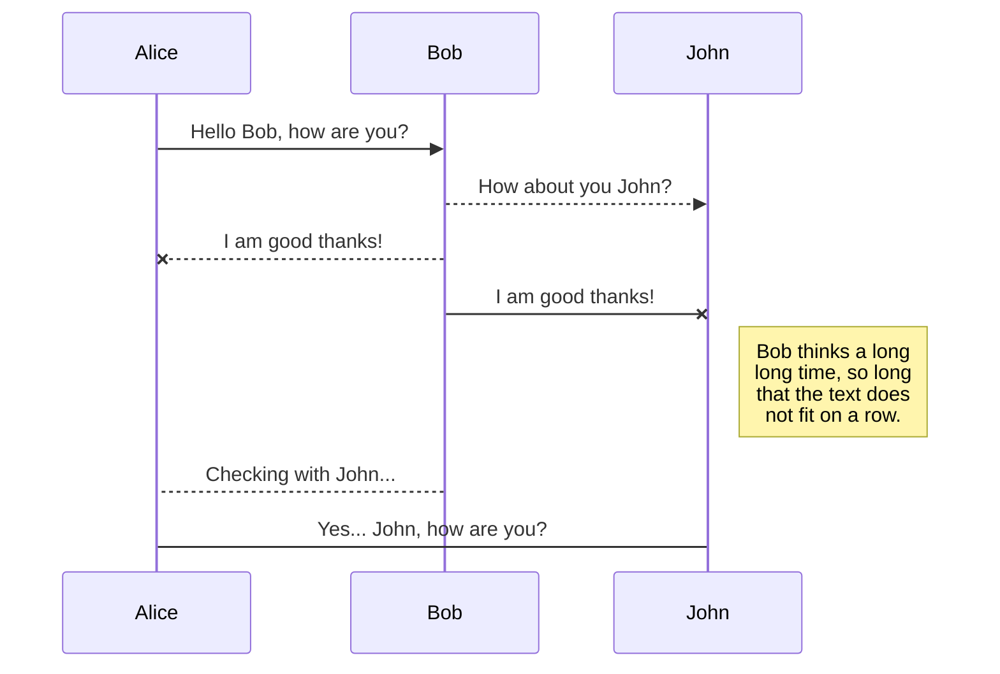

# 🚀  Astro — Diagrams with Mermaid JS 🧜🏻‍♀️

Embed you Mermaid diagrams in no time inside your Astro templates.  
Features **server-side rendering** and **smart caching**.  
Available as a stand-alone component or as an MDX plugin, replacing `mermaid` code blocks.

---

Uses Muhammad Muzzammil' [`headless-mermaid`](https://github.com/muhammadmuzzammil1998/headless-mermaid) under the hood.  
And of course, the [`mermaid`](https://github.com/mermaid-js/mermaid) library.

## 📦  Installation

```sh
pnpm i @julian_cataldo/astro-diagram headless-mermaid
```

## 🛠  Usage

```astro
---
import Diagram, { Config } from '@julian_cataldo/astro-diagram/Diagram.astro';

const config = {
  theme: 'forest',
  // ...
} as Config;

const code = `
sequenceDiagram
Alice ->> Bob: Hello Bob, how are you?
Bob-->>John: How about you John?
Bob--x Alice: I am good thanks!
Bob-x John: I am good thanks!
Note right of John: Bob thinks a long<br/>long time, so long<br/>that the text does<br/>not fit on a row.

Bob-->Alice: Checking with John...
Alice->John: Yes... John, how are you?`;

// ...
---
```

```astro
<!-- ... -->
<body>
  <!-- Place component inside `BODY` tag -->

  <Diagram config={config} code={code /* required */} />

  <!-- ... -->
</body>
```

### With MDX

> **Warning**  
> This is still a work-in-progress.  
> There is still some rendering bugs and inconsistencies.

In your `astro.config.mjs`:

```js
import mdxMermaidPlugin from '@julian_cataldo/astro-diagram';
// ...

export default defineConfig({
  // ...
  integrations: [
    mdx({ remarkPlugins: { extends: [mdxMermaidPlugin] } }),
    // ...
  ],
  // ...
});
```

Then, in your MDX, use the `mermaid` language for your code fences, exactly like you would on GitHub flavored Markdown for example.

<div class="git-hide">

## 🎉  Result



</div>

## To do

- [ ] Improve Astro **MDX** integration  
       Refs.:  
       See https://github.com/sjwall/mdx-mermaid  
       Unist visit: https://github.com/sjwall/mdx-mermaid/blob/main/src/mdxast-mermaid.ts
- [ ] Fix styling and layout bugs
- [ ] Support dark / light color mode

<div class="git-footer">

---

## [LIVE DEMO  🎭  DOCUMENTATION WEBSITE ⎋](https://code.juliancataldo.com/)

[](https://code.juliancataldo.com)

**_[`code.juliancataldo.com`](https://code.juliancataldo.com/)_**

---

🔗  [JulianCataldo.com](https://www.juliancataldo.com/)

</div>
